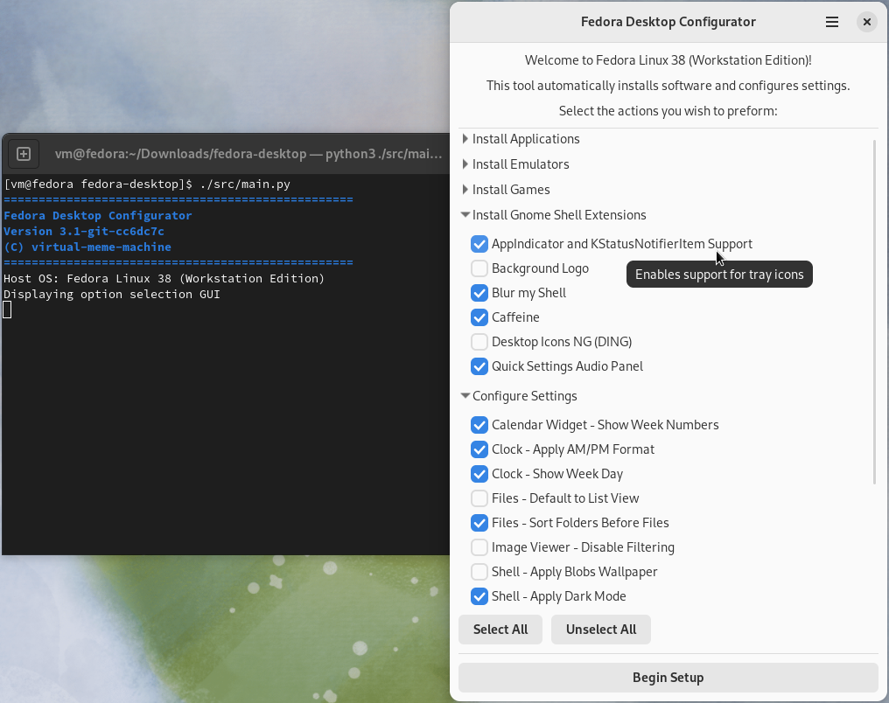

# Fedora Desktop Configurator

Automated post-installation configuration tool for Fedora Linux (Workstation Edition).

Supports Fedora Linux 37, 38 and 39 as of November 2023.



## What Can This Do?

See [Options](docs/Options.md) for a complete list of actions Fedora Desktop Configurator can perform.

## Usage

1. Install [Fedora Linux](https://www.fedoraproject.org/en/workstation/download)
    1. [Fedora Linux 39 Live ISO](https://download.fedoraproject.org/pub/fedora/linux/releases/39/Workstation/x86_64/iso/Fedora-Workstation-Live-x86_64-39-1.5.iso)
    2. [Fedora Linux 38 Live ISO](https://download.fedoraproject.org/pub/fedora/linux/releases/38/Workstation/x86_64/iso/Fedora-Workstation-Live-x86_64-38-1.6.iso)
    3. [Fedora Linux 37 Live ISO](https://download.fedoraproject.org/pub/fedora/linux/releases/37/Workstation/x86_64/iso/Fedora-Workstation-Live-x86_64-37-1.7.iso)
2. Perform initial setup (create an account, etc.), most options can be skipped or left default
3. Once at the desktop, open a terminal and git clone this package:
    ```bash
    git clone https://github.com/virtual-meme-machine/fedora-desktop.git ~/fedora-desktop
    ```
4. Launch Fedora Desktop Configurator:
    ```bash
    ~/fedora-desktop/src/main.py
    ```
5. Select your preferred options or load a profile
6. Click 'Begin Setup'

### Profiles

Fedora Desktop Configurator supports saving and loading pre-defined sets of options known as 'profiles'.

See [Profiles](docs/Profiles.md) for more information.

### Non-Interactive Mode

Fedora Desktop Configurator can also be used to non-interactively install a profile.

```bash
~/fedora-desktop/src/main.py --profile /path/to/your_profile.profile
```

## Contributing

Interested in contributing? See [CONTRIBUTING.md](docs/CONTRIBUTING.md).
