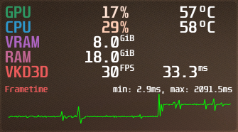

# Fedora Desktop Configurator

Automated post-installation configuration tool for Fedora Linux (Workstation Edition).

Supports Fedora Linux 37 and 38 as of May 2023.


## What Can This Do?

See [Options](docs/Options.md) for a complete list of actions this tool can preform.

## Usage

**!! DO NOT enable third-party repos if asked, this script will set up RPM Fusion and Flathub on its own !!**

1. Clean install [Fedora Linux](https://www.fedoraproject.org/en/workstation/download) on your host
    1. [Fedora Linux 37 Live ISO](https://download.fedoraproject.org/pub/fedora/linux/releases/37/Workstation/x86_64/iso/Fedora-Workstation-Live-x86_64-37-1.7.iso)
    2. [Fedora Linux 38 Live ISO](https://download.fedoraproject.org/pub/fedora/linux/releases/38/Workstation/x86_64/iso/Fedora-Workstation-Live-x86_64-38-1.6.iso)
2. Preform initial setup (create an account, etc.)
3. Once at the desktop, open a terminal and git clone this package somewhere on the host:
    ```bash
    git clone https://github.com/virtual-meme-machine/fedora-desktop.git ~/fedora-desktop
    ```
4. Enter the package directory and run `main.py`:
    ```bash
    cd ~/fedora-desktop
    ./src/main.py
    ```
5. Select the configuration actions you want the tool to preform, then click 'Begin Setup'

---

# Related Information

## MangoHud



MangoHud is a performance monitoring overlay similar to MSI Afterburner or EVGA Precision X.

You can modify the layout, settings, key bindings, etc. for MangoHud using GOverlay.

#### Key Bindings

The 'Configure MangoHud' option applies a config file which uses the following key bindings:

- `Right Shift + F10` - Upload Log
- `Right Shift + F11` - Start / Stop Logging
- `Right Shift + F12` - Show / Hide MangoHud

## OpenRGB

OpenRGB is a unified interface for managing RGB hardware and peripherals such as keyboards, case fans, headsets, etc.

OpenRGB supports a variety of devices, check the [OpenRGB website](https://openrgb.org) for detailed compatibility info.

#### I2C/SMBus Initialization Errors

Some devices may not be detected if the `i2c_dev` kernel module is not loaded.

If OpenRGB displays warning messages regarding i2c, you can load the `i2c_dev` kernel module with:

```bash
sudo modprobe i2c_dev
```

## Steam

Steam for Linux can run most Windows games via a compatibility layer called Proton.

Proton is included with Steam but disabled by default,
[this tutorial](https://steamcommunity.com/sharedfiles/filedetails/?id=1974055703)
details how to enable Proton as well as some advanced options.

[ProtonDB](https://www.protondb.com) is a great resource for checking how well a game will run on Linux via Proton.
